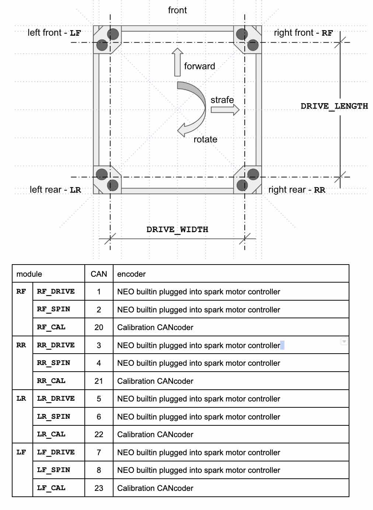
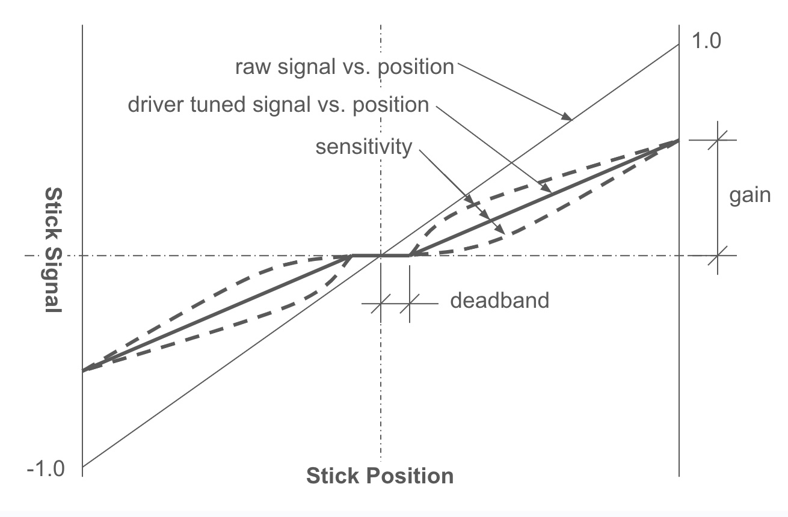

* **version:** 2024.2.5
* **status:** first used for FRC **2023 Charged Up**
* **comments:** This code was extracted from our 2022 code base to provide a stable and growing code
  base to jump start future years.

# a05annexRobot

The A05annex base library for a Swerve Drive Base with NavX, autonomous paths with actions, and selection of
autonomous path (there are generally many possible paths depending on field start position and alliance strategy)
and driver preferences (drivers are conditioned by the games they play, the driver preference lets the driver natch
the robot response to their favorite game).

## Change Log

<details>
  <summary>version 0.0.31 to 2024.2.6 (for <b>2024 Crescendo</b>):</summary>
  <ul>
   <li>2024.2.6 - Added </li>
   <li>2024.2.5 - Fixed scope error in A05AprilTagPositionCommand</li>
   <li>2024.2.4 - Fixed an error in <code>SpeedCachedSwerve.getRobotRelativePositionSince(...)</code>
     introduced in the last version where target times more than 1 command cycle into the future would report
     an incorrect projection. With more complete tests for phase in the cache.</li>
   <li>2024.2.3 - Fixed a problem in the <code>SpeedCachedSwerve.getRobotRelativePositionSince(...)</code> with
     requests when the most recent april tag position is after the last logged request (a condition we had never
     seen before, but see now because the orange pi 5 can process upwards of 100fps)</li>
   <li>2024.2.2 - Cleanup of REV deprecations. Improved documentation in <code>A05Constants</code>. Improved driver
     initialization if configuration switches cannot be read.</li>
   <li>2024.0.1 - Revised the versioning scheme to be more consistent with WPIlib and vendor dep
     versioning scheme.</li>
   <li>0.0.33 - 2024 WPIlib release version 2024.2.1 integration, updated all vendor deps, fixed some minor issues
     introduced by the new photonvision library;</li>
   <li>0.0.32 - 2024 WPIlib beta version 2024.1.1-beta-4 integration:</li>
    <ul>
    <li>update build to gradle 8.4;</li>
    <li>Java support to Java 17;</li>
    <li>update all vendor dependencies;</li>
    <li>replaced deprecated edu.wpi.first.wpilibj2.command.CommandBase class with
      edu.wpi.first.wpilibj2.command.Command;</li>
    <li>Migrate from CTRE Phoenix5 to Phoenix6 software (only applies to the CAN coders on the swerve
      modules (a painful change in the programming model and the initialization defaults for the
      CANcoder).</li>
    </ul>
  </ul>
</details><details>
  <summary>version 0.0.1 to 0.0.31 (for <b>2023 Charged Up</b>):</summary>
  <ul>
    <li>0.0.31 - Cleanup and testing of SwerveSpeedCache phase adjustment;</li>
    <li>0.0.30 - Added A05AprilTagPositionCommand;</li>
    <li>0.0.29 - Added SpeedCachedSwerve;</li>
    <li>0.0.23 - Post-competition cleanup. Moving common Spark-NEO and Spark-NOE550 combination into
             a tested wrapper that formalizes our 95% use case into a simple and repeatable pattern;</li>
    <li>0.0.21 - Code to burn default configuration into the Sparks;</li>
    <li>0.0.20 - Added a methods to IServeDrive to get the actual underlying subsystem;</li>
    <li>0.0.19 - Fixed a problem burning configuration state into the Sparks introduced in 0.0.18;</li>
    <li>0.0.18 - Added a recalibrate method for the swerve so it could be recalibrated prior to any enable, this was
             a band-aid to not burning configuration into the Spark and having occasional configuration
             issues;</li>
    <li>0.0.17 - ISwerveDrive can be set for the A05DriveCommand allowing extensions of the DriveSubsystem
             that add game-specific functionality;</li>
    <li>0.0.16 - Changed ordering of swerves in translate commands to try to reduce rotational drift;</li>
    <li>0.0.15 - Current limited swerve drive and spin motors;</li>
    <li>0.0.13 - Added a NavX calibration factor to minimize rotational drift;</li>
    <li>0.0.12 - Made heading correction after translate optional;</li>
    <li>0.0.11 - Tuned smart motion coefficients;</li>
    <li>0.0.10 - AbsoluteSmartTranslateCommand - first smart motion implementation;</li>
    <li>0.0.9 - Added max speed and heading correction at end of translate;</li>
    <li>0.0.8 - Added getClosestDownField(), getClosestUpField(), getClosestDownOrUpField() to
            NavX.HeadingInfo;</li>
    <li>0.0.4 - AbsoluteTranslateCommand - move by position;</li>
    <li>0.0.2 - Optional mirroring of autonomous for <b>2023 Charged Up</b>;</li>
    <li>0.0.1 - Initial internal release.</li>
  </ul>
</details>

## Creating a Robot Project Using this Library

We have already done this for you. see [a05annexTemplate](https://github.com/A05annex/a05annexTemplate)

## The Design Pattern for Competition-Specific Constants

It was an interesting coding pattern exercise to decide how to define and use 'constants' representing the year's
robots, drivers, and autonomous paths populated by the competition code built on top of the <tt>a05annexRobot</tt>
library. At issue is that constants declared in the competition code are not accessible to the library, so they need
to be declared in the <tt>a05annexRobot</tt>, but populated in the competition code. The pattern is:
* To define the data
  classes in the <tt>[A05Constants](
  https://github.com/A05annex/a05annexRobot/blob/main/src/main/java/org/a05annex/frc/A05Constants.java)</tt> file, so
  you will see we have the classes <tt>RobotSettings</tt>, <tt>DriverSettings</tt>, and <tt>AutonomousPath</tt> for
  describing s robot profile, a driver profile, or an autonomous path respectively;
* To define a list For each of the data classes as <tt>List<RobotSettings> ROBOT_SETTINGS_LIST</tt>,
  <tt>List<DriverSettings> DRIVER_SETTINGS_LIST</tt>, and <tt>List\<AutonomousPath\> AUTONOMOUS_PATH_LIST</tt> for
  robot profiles, driver profiles, nd autonomous paths respectively;
* To populate the previously lists in the competition project code in the <tt>
  [Robot](https://github.com/A05annex/a05annexTemplate/blob/main/src/main/java/frc/robot/Robot.java).RobotInit()</tt>
  method by loading arrays defined in the <tt>
  [Constants](https://github.com/A05annex/a05annexTemplate/blob/main/src/main/java/frc/robot/Constants.java)</tt>;
* And finally, the <tt>[A05RobotContainer](https://github.com/A05annex/a05annexRobot/blob/main/src/main/java/org/a05annex/frc/A05RobotContainer.java)
  </tt> constructor reads the configuration selection switches for robot profile, driver profile, and autonomous path
  and loads/initializes the those values for the match. NOTE: our use of switches on the robot for configuration
  comes from a time where there was a lot of chatter billing SmartDashboard as unreliable and not up to the task.
  Current WPIlib documentation is very explicit about how to do this correctly, i.e.
 [Choosing and Autonomous Program](https://docs.wpilib.org/en/stable/docs/software/dashboards/smartdashboard/choosing-an-autonomous-program-from-smartdashboard.html),
 so we will be revising this for the 2024 season.

## Robot Swerve Drive

This project base assumes we are using a
[swerve drive specialties MK4 drive](https://www.swervedrivespecialties.com/products/mk4-swerve-module?variant=39376675143793)
swerve drive base. The specifics of the base geometry are ***VERY*** important in getting this software to correctly
control the drive, and the motor controllers and encoders must have the CAN bus IDs as shown below:


We spent a lot of time working on optimal module performance, and this is
the [Swerve Programming paper](./resources/SwerveProgramming.pdf) that describes the details.

## Characterizing Your Team's Robot(s)

Every robot base will probably be slightly different in terms of geometry, swerve modules, Roborio, and NavX; so we
wanted a way we could setup the parameters for both our competition and practice/prototype robot so that we did not
maintain different code branches for each. We want to be able to run the same code on both robots. To satisfy this
we introduce an
<tt>[A05Constants](
https://github.com/A05annex/a05annexRobot/blob/main/src/main/java/org/a05annex/frc/A05Constants.java).RobotSettings
</tt> class to represent a physical robot, and the
<tt>[A05Constants](
https://github.com/A05annex/a05annexRobot/blob/main/src/main/java/org/a05annex/frc/A05Constants.java).ROBOT_SETTINGS_LIST
</tt> to represent your team's robots.
<details><summary>
What follows are the details of robot representation and calibration:
</summary>

### Representing Your Robot(s)

We generally have 2 similar swerve drive robots. The first is test/prototype robot,usually the robot from last season
with the competition-specific appendages removed. The second is this season's competition robot. While these robots
are generally very similar, there are generally some differences in geometry, electronics (different navX2 boards),
physical state (how new are the wheel treads), etc.

See the <tt>[A05Constants](
https://github.com/A05annex/a05annexRobot/blob/main/src/main/java/org/a05annex/frc/A05Constants.java).ROBOT_SETTINGS_LIST
</tt> documentation for a description of all of the parameters in this class, all set in the
constructor. The [ao5annexTemplate
<tt>Constants</tt>](https://github.com/A05annex/a05annexTemplate/blob/main/src/main/java/frc/robot/Constants.java)
defines 2 robots: a "Competition" robot at index 0; and a "Practice" robot at index 1.
We use the roborio DIO input port 5 for our robot (since we only have 2, if you have more robots, you might
want to use 5 and 6). The "Competition" robot is the index 0 entry in the list, so it does not require any
changes to the Roborio (i.e. with nothing connected to DIO port 5 it will report a state of 0). The "Practice" robot
requires a jumper on DIO port 5 that connects the signal
pin to ground. This convention was chosen to minimize the things that could go wrong on the competition robot.

### Robot Settings Detail

Drive calibration is primarily focused on characterizing the performance of the <tt>DriveSubsystem</tt>
and <tt>NavX</tt> so that the robot behaves as expected during driver control, and, so that autonomous paths and
the <tt>SwerveSpeedCache</tt> can be accurately mapped to robot behaviour.

* *id* and *name*: The *id* is used to confirms that the robot settings entry is at the index you expect it to be
  so it is consistent with your robot selection UI. The *name* is for UI display of which robot
  configuration is selected.
* *length* and *width*: The should be measured from the center of the rotation shaft (analog position encoder). This
  library currently supports ***ONLY*** a rectangular arrangement of swerve modules. If you are doing something
  different, this library is not for your robot(s).
* *swerve module calibration constants*: These are the readings of the analog swerve module encoders when the drives
  are facing forward. We send the analog encoder readings to the smart dashboard regardless of the enable/disabled
  state; disable the robot; manually spin each wheel until it is facing forward; then use a straightedge on the right
  and left sides to force the front and rear wheels into alignment. The values we read for the analog encoders at
  that time are saved as our calibration constants.
* *navxYawCalibration*: this is a correction for the drift-per-spin that we have measured for the navX2 board that
  is on this robot. This calibration is vital for having the robot maintain up-field and down-field orientation
  regardless of the direction and number of spins the robot has made. See the next section for notes on measuring
  and setting this value.
* *maxSpeedCalibration*: this is a correction between the calculated maximum module speed (using module gear
  ratio, and motor specifications) and the measured maximum speed along a a well specified control path. This
  calibration is vital for having the robot track autonomous paths correctly.

### Robot Drive/NavX Calibration

Drive calibration is primarily focused on characterizing the performance of the <tt>DriveSubsystem</tt>
and <tt>NavX</tt> so that the robot behaves as expected during driver control, and, so that autonomous paths and
the <tt>SwerveSpeedCache</tt> can be accurately mapped to robot behaviour. In and ideal world, these calibrations
would be performed at each competition, and, if warranted, multiple times during a competition. The reason for
this is that in addition to robot changes over time, each competition venue presents a different field
surface - which is a primary factor in calibration.

***TODO - finish this.***

</details>

## Drive Control and Driver Tuning

<details>
<summary>Over multiple seasons we discovered that there are 2 driving modes for swerve drives that are critical:
<ul>
    <li><b>Field Relative</b> - The driver is in a fixed position watching the robot on the field, and there is often
     no clear front/back to a robot. The speed-direction stick describes where the driver wants the robot to go 
     relative to the field/driver;</li>
    <li><b>Robot Relative</b> - This is what we always did with a conventional tank drive (right and left banks of
     wheels that here steered by setting some delta between right and left). The control is as though the driver is
     sitting in the robot (which is backwards when the robot is moving towards the driver). However, when you are
     performing a precision task watching the screen display of the robot camera - you now need driver mode.</li>
</ul>
We also discovered that the drive control should be tuned to the driver. Occasional drivers or guest drivers during
robot demonstrations should be highly constrained so the robot doesn't smash things at high speeds. Competition
drivers should tune control to match their favorite game.
</summary>

### Field Relative

What is happening in field-relative mode is we simply difference the stick direction with the
robot heading to transform the field relative direction to a robot relative direction.

### Robot Relative

What is happening in robot-relative mode is that stick direction is the robot-relative direction. Note that if
the camera is not facing directly forward, it is easy to change the robot-relative to camera relative by simply
differencing the stick direction with the
camera heading (relative to the robot) to transform the camera relative direction to a robot relative direction.

### Driver Tuning

The most important aspect of driver tuning is the realization that it is a necessity, not an option. There are
potentially many different drivers of the robot with very different driving skill sets and that it is desirable to
be able to specify a specific driver or generalized driver skill set, and reset the robot control to maximize
the probability of success for that driver. How do we do that? We save a variety
of driver profiles and support loading the appropriate driver profile when the robot is powered-up.

We have tried a number of different controller types and configurations through the years and have settled on the
use of Xbox style controllers, one for the driver, and one for the operator.
* **Driver Xbox Controller** - Everything that is about manually driving the robot including:
  * Either field relative (driving from the driver station) or robot relative (driving by the robot mounted camera);
  * Aids for orienting the robot downfield, upfield, or in operation-specific headings;
  * Accelerated (*boost*) motion override;
  * Fine (*slow*) motion override.
* **Operator Xbox Controller** - the operator does everything else - including adjusting the drive tuning parameters
  at the drivers direction. We have a robot code branch specifically for tuning where all the operator controls
  are mapped to tuning parameters that map controller actions to robot behaviour.

#### What Do We Tune?


There are a number of control parameters we tune. Review the illustration above - what driver tuning does is map the
raw signal from the stick to a conditioned signal representing the desired driver action. The sensitivity is an
exponent applied to the signal, so a gain of 1.0, deadband of 0.0, and exponent of 1.0 will result in the driver
tuned signal being identical to the raw signal. 

We have found that robot translation and rotation are most intuitively decoupled, that is; one stick should control
translation (movement forward, backward, right,and left - with no change in robot heading), and the other should
control robot rotation (field heading). Similarly, the tuning for translation and rotation should be similarly
decoupled. Additionally, we have separated: normal driving conditions, a *boost* mode, and a *slow* mode. These modes
can be better described as:
* default (normal driving conditions) - similar to how you would want you car to behave in city traffic. You need a
  balance of control and speed, but you would seldom, if ever, use the maximum speed or minimum turning radius. This
  is your default driving profile for a match;
* *boost* - like getting on the freeway. The path is clear ahead, your robot is correctly oriented, and you want to
  use the maximum speed available.
* *slow* - like wanting to parallel park, you need control, not speed. An example of this would be positioning your
  robot to attach to a climbing bar for and end-game robot hang.

The important parameters for driver tuning are:
* **gain** (speed, boost, slow, or rotation) - This is the maximum translation speed (forward, backward, left,
  and/or right) for *normal*, *boost*, or *slow* driving; or maximum rotation speed.
* **deadband** (speed or rotation) - Deadband is especially important for rotation because when there is no rotation
  input (rotation = 0.0), the DriveCommand maintains robot heading (i.e. if heading is changed due to drive
  drift, robot contact with field elements, or robot contact with other robots, the drive will automatically
  restore the heading. The deadband
  should be large enough to assure that minor unintentional pressure on the rotation stick, or failure of the stick
  to center to exactly 0.0 is not interpreted as a rotation command.
* **sensitivity** (speed or rotation) - This is an exponent applied to the signal. An exponent greater than 1.0
  flattens the curve next to 0.0 and gives better control at low speeds. An exponent less than one accelerates the
  robot quickly, and gives better control at the high speeds.
* **maximum acceleration** (speed or rotation) - This is a limit on the change in speed or rotation in a command
  cycle. This limit should be set so the wheels don't go into a skid mode as that makes field position telemetry
  completely unreliable.

#### How Do We Tune?

We tune using the
[*drive-tuner* branch of Ao5annex/ao5annexTemplate](https://github.com/A05annex/a05annexTemplate/tree/drive_tuner)
which is simply a swerve drive robot with the driver control and a mapping of operator controls to manipulate the
tuning parameters. This is a good first exercise in driver-operator communication as the driver needs to communicate
to the operator the desired changes in driver settings while driving and testing settings.

#### How Do We Save a Driver Profile?

All driver profiles are saved in *.json* files, and those files are in the *./src/main/deploy/drivers* directory
of your robot project so that they will be downloaded to the robot with the rest of your robot code.
The driver profile is saved as a simple list of driver coefficients in a dictionary with these keys:
- **<tt>"DRIVE_DEADBAND"</tt>**: (required,double) The distance from 0.0 that is the 'dead' area of the stick for robot
  speed. Generally as small as possible without introducing drift when a driver thinks they are going pure
  forward-back, or left-right. Generally <= 0.05.
- **<tt>"DRIVE_SPEED_SENSITIVITY"</tt>**: (required,double) Speed sensitivity. A sensitivity of 1.0 matches the linear
  raw performance of the stick. We find 2.0 to 3.0 is generally a range where the driver feels they have sufficient
  low-speed, or 'fine' control.
- **<tt>"DRIVE_SPEED_GAIN"</tt>**: (required,double) The maximum robot speed the driver feels comfortable with in
  normal driving where 0.0 is the robot stopped, and 1.0 is the fastest the robot can possibly go.
- **<tt>"DRIVE_SPEED_MAX_INC"</tt>**: (required,double) The maximum speed increment (either accelerate or decelerate)
  in a command cycle. Generally something in the 0.05 to 0.15 range gives good control without sending the robot into
  skid modes when the driver does something extreme.
- **<tt>"ROTATE_DEADBAND"</tt>**: (required,double) See <tt>DRIVE_DEADBAND</tt>. The near zero dead zone for the
  rotation stick. It is important that this be large enough to prevent un-intended rotation commands as any rotation
  command resets the desired heading for the robot.
- **<tt>"ROTATE_SENSITIVITY"</tt>**: (required,double) Rotation sensitivity, see <tt>DRIVE_SPEED_SENSITIVITY</tt>.
- **<tt>"ROTATE_GAIN"</tt>**: (required,double)  The maximum robot rotation the driver feels comfortable with in
  normal driving where 0.0 is the robot stopped, and 1.0 is the fastest the robot can possibly spin.
- **<tt>"ROTATE_MAX_INC"</tt>**: (required,double)  The maximum rotation increment (either accelerate or decelerate)
  in a command cycle. Generally something in the 0.05 to 0.15 range gives good control without sending the robot into
  skid modes when the driver does something extreme.
- **<tt>"BOOST_TRIGGER"</tt>**: (required,string) <tt>LEFT</tt> or <tt>RIGHT</tt> - the trigger that
  invokes *boost* mode.
- **<tt>"BOOST_GAIN"</tt>**: (required,double) The speed gain when the driver has the robot lined up and wants to go
  at the fastest speed the robot can attain. Generally 1.0 for competition drivers, and perhaps a little higher than
  <tt>DRIVE_SPEED_GAIN</tt> for non-competition drivers.
- **<tt>"SLOW_TRIGGER"</tt>**: (required,string)  <tt>LEFT</tt> or <tt>RIGHT</tt> - the trigger that
  invokes *slow* mode. Must not be the same as <tt>BOOST_TRIGGER</tt>.
- **<tt>"SLOW_GAIN"</tt>**: (required,double) The speed gain for precision positioning of the robot, often using the
  camera and *Robot Relative* drive control. Generally about 0.5 times the <tt>DRIVE_SPEED_GAIN</tt>.

This is an example of a driver profile file (for our primary 2023 competition driver):
```
{
  "DRIVE_DEADBAND": 0.05,
  "DRIVE_SPEED_SENSITIVITY": 2.0,
  "DRIVE_SPEED_GAIN": 0.6,
  "DRIVE_SPEED_MAX_INC": 0.075,
  "ROTATE_DEADBAND": 0.05,
  "ROTATE_SENSITIVITY": 1.5,
  "ROTATE_GAIN": 0.4,
  "ROTATE_MAX_INC": 0.075,
  "BOOST_TRIGGER": "LEFT",
  "BOOST_GAIN": 1.0,
  "SLOW_TRIGGER": "RIGHT",
  "SLOW_GAIN": 0.4
}
```

#### How Do We Configure Driver Setting for a Match?

The steps in making the driver profile configurable are:
* Build a driver profile and adopt a naming convention for the driver profiles, we normally just use the
  driver's first name;
* Put the profile in the *./src/main/deploy/drivers* directory;
* Assuming you have used the [a05annexTemplate](https://github.com/A05annex/a05annexTemplate) as a starting point for
  your project (or are just referring to that templete in *github*) - in <tt>frc.robot.Constants.java</tt> find the
  <tt>A05Constants.DriverSettings[] DRIVER_SETTINGS</tt> array, and add an entry for your driver. The
  <tt>id</tt> is the driver selection switch value for that driver, and is used to make sure switches are being
  mapped to the correct driver file.
* We configure the driver by setting switches during robot setup on the field (really, while we are in the match queue),
  to select the driver profile. This means the driver profile is loaded at robot power-up, regardless of the driver
  station state or the field control system state. This has been 100% reliable for us (barring human failure to throw
  the correct switches) during competition. Inspecting <tt>A05RobotContainer</tt> constructor, you will see that
  the first thing that happens is reading the configuration switches (switches 1 and 2, 1 being the first switch which
  is wired to the Roborio DIO 0 port, and 2 being the second switch which is wired to the Roborio DIO 1 port) and
  loading the corresponding driver profile.
</details>

## NavX

<details>
<summary>This section discusses our
<a href="https://github.com/A05annex/a05annexRobot/blob/main/src/main/java/org/a05annex/frc/NavX.java"><tt>NavX</tt></a>
class wrapping the navX inertial navigation board and why
we created it. We have used the Kauai Labs navX boards since our inception and recently switched to the
<a href="https://www.kauailabs.com/navx-mxp/">navX2<sup>MXP</sup></a>. This is an inertial navigation board that
senses the navX2 board position at startup and then reports changes to the board orientation relative to that
start position as the match progresses. During the entire match we use the navX2 to heading correct during autonomous
path following, align the robot up-field and down-field during driver control, as well as maintaining heading during
driver control when the driver is not providing a rotation input.
</summary>

The primary issue with the naX2 library, and having it be a really useful robot navigation aid, is the -180&deg;(-&pi;)
to +180&deg;(+&pi;) heading boundary. Very simply, suppose my robot is oriented downfield at the start of a match,
i.e., the heading is +0&deg;(+0.0&pi;); my robot will go down-field 2m picking up a game piece on its way. Now my
robot will turn +180&deg;(+&pi;) to the right and come back and deliver the game piece, then my robot will
turn +90&deg;(+&pi;/2.0), go 1m, and turn to the right +90&deg;(+&pi;/2.0) and head up-field to collect
my next game piece. The problem here has several manifestations:
* After picking up the first piece and turning +180&deg;(+&pi;), the robot is riding the +180&deg;(+&pi;) to
  -180&deg;(-&pi;) navX boundary, so writing the PID loop to maintain heading needs to account for the
  boundary - which is special purpose code.
* Once the first piece is delivered, the robot turns from +180&deg;(+&pi;) to -90&deg;(-&pi;/2.0) using the navX
  heading. While we are trying to make a +90&deg;(+&pi;/2) turn, normal PID code would have us spin the robot
  -270&deg;(-3&pi;/2) instead of +90&deg;(+&pi;/2), which is clearly suboptimal.

The real problem here is that, from a navX perspective, if the robot makes a complete rotation to the right or left,
it is back at +0&deg;(+0&pi;), rather than +360&deg;(+2&pi;) or -360&deg;(-2&pi;) - which reflects a complete
rotation. The <tt>NavX</tt> heading counts the rotations and reports a true relative heading from the initial
heading, including all rotations - so if
the robot has spun 2 rotations to the right and is now headed down-field, the heading will be +720&deg;(+4&pi;),
and likewise, if the robot has spun 2 rotations to the left and is now headed down-field, the heading will be
-720&deg;(-4&pi;).

### Convenience Functionality and Methods

This is a summary of features provided by the <tt>NavX</tt> wrapper:
* **initial heading** - The robot may not be positioned facing downfield so the initial heading will not
  be +0&deg;(+0.0&pi;). The <tt>NavX.initializeHeadingAndNav(AngleConstantD)</tt> method initializes for any initial
  heading of the robot so that a <tt>NavX</tt> heading of +0&deg;(+0.0&pi;) will actually be down-field.
* **expected heading** - the <tt>NavX</tt> class formalizes the idea of an expected heading, which is the heading
  the robot is expected to maintain if no rotation commands are sent to the robot.
* **closest up-field/down-field headings** - we found it common that a driver would want to orient the robot either
  directly up-field or directly down-field, but the driver was so focused on getting the robot through the field
  traffic that driving heading at the same time was just too much to think about. This lead to up-field and
  down-field driver control buttons that would automatically face the robot up-field or down-field while the driver
  focused on driving a path through the field traffic. The buttons <tt>NavX.HeadingInfo.getClosestDownField()</tt> or
  <tt>NavX.HeadingInfo.getClosestUpField()</tt> and then <tt>NavX.setExpectedHeading(AngleConstantD)</tt> to that
  heading.
* **closest heading to an arbitrary heading** - because sometimes pickup and/or delivery stations are not
  up-field/down-field oriented, but at some arbitrary (competition-specific) field heading and you want to be
  able to find the closest heading as <tt>NavX.HeadingInfo.getClosestHeading(AngleD)</tt>, and
  then set that as the <tt>NavX.setExpectedHeading(AngleConstantD)</tt>.
* **drift error correction** - We found that the navX2<sup>MXP</sup> had board-specific per rotation drift. i.e.
  after 1 rotation, the heading reading would not be +360&deg;(+2&pi;) or -360&deg;(-2&pi;), see the next section for
  a discussion of this.

### navX Drift Error Correction

In the 2022 and 2023 seasons the programming team received repeated complaints that the robot down-field heading was
drifting throughout the match, requiring re-initialization of the downfield heading during the match. We spent some
time trying to diagnose this and discovered that when the robot made a full revolution, the robot heading when facing
downfield was no longer zero (a multiple of 360&deg;(2&pi;)). The more revolutions in the same direction, the further
the drift. If the rotations were unwound (the same number of spins in the opposite direction), then downfield would
return to very near zero.
</details>

## Autonomous Paths
