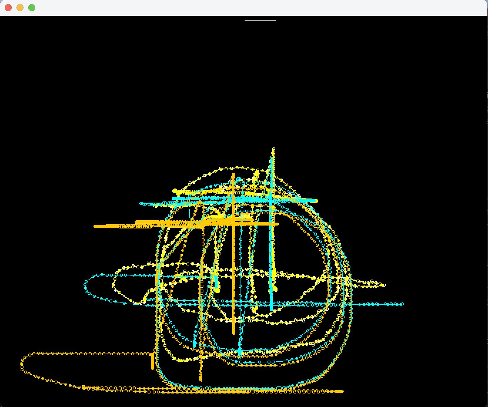

# Tuning (Calibrating) the SpeedCachedSwerve

The <tt>SpeedCachedSwerve</tt> is a software layer for the swerve <tt>DriveSubsystem</tt> that, given a field position
sometime in the past, will predict where the robot is on the field now.

## What? Why?

Our initial programming to use april tags resulted in either extremely slow, or wildly unpredictable (oscillating)
robot motion when trying to reach the target position.
April tags were the primary visual field position markings for *2023 Charged Up*. They presented a challenge because
there is a latency in the april tag processing that can range from roughly 20ms to 100ms. So the robot position
data is sufficiently old that when the the april tag position is used as input to a PID robot position controller,
instability (oscillation) can only be prevented if PID constants are ridiculously small - resulting in the robot
creeping to the desired position.

During the *2023 Charged Up* season we developed a <tt>SpeedCachedSwerve</tt> to address this problem. The idea was
that this cache would save the timestamped commands to the swerve drive subsystem, and, given a sensor (april tag)
position sometime in the past, predict the current position of the robot so the optimal PID correction can be
computed. While this was reasonably successful, this was only an empirical evaluation (seemed better than without it).
So on the off-season, we decided to really investigate haw to best use april tags.

## The Testing Methodology

We elected to use a testing strategy where we would drive the robot around an april tag and record the april tag
sensed positions, the <tt>SpeedCachedSwerve</tt> commands, the predicted robot positions when the april tag positions
were read, and then plot all this stuff so we could really try to understand what is happening and how to best use
april tags. We had no idea what to expect when we started this exercise. The results were very interesting.

### First Test 2023-07-12 (12 July 2023)

For this test we dragged in the carpet, tried to stretch it and put heavy desks/tables on it to anchor it, taped an
april tag to the wall, and drove around a bit. Though we had some heavy furniture on the carpet, it was no stretched
out, so it moved a bit. Our initial attempts to plot things showed us this:

In this plot, the test is quite long (like 50 seconds), and we mostly discovered we were not logging what we
really needed to log to analyze the results of the test. In the image above, the april tag is at the top of the screen
and we are looking at a view from above the field. The various traces are:
* **white** - the reported april tag position.
* **yellow** - we saw a lot of noise in tha april tag position and tried passing a gaussian filter over it.
* **cyan** - the path of the robot predicted by the cache based on the april tag position at the start of the path.
* **orange** - what the current cache code predicts the position of the robot should be based on the april tag
  position at the start of the path. This should be the same as the **cyan** path unless the speed cache code
  is altered since the test - this points out some obvious logging issues.

Conclusion - we really didn't have a test plan, and learned that logging was not telling us what we needed for
analysis. We initially stared by implementing a command that locked heading and started logging april tag state
and commands to the swerve. Initial analysis attempts were hampered because every time any parameter is logged
that creates a new log entry, so it was difficult to isolate the state for the command; additionally information
about losing the april tag, performing multiple runs of the command, etc. were not sufficiently thought out to
allow us to make the logs comprehensible. Subsequent logging changes:
* **Speed Cache Logging** - The speed cache does it's own logging, turned on by a configuration command. This allows
  the state of the cache during the test to be exactly recreated during analysis. Some specifics:
  * The speed cache entry is a a single string per command cycle, so we know there is a new entry if the string
    changes (i.e. the time will change every command cycle even if nothing else does);
  * In addition to time, forward, strafe, and rotation, the expected and actual heading are now logged and saved
    in the cache.
* **April Tag Logging** - Mostly to make it easier to parse and modify logging:
  * The april tag info is now a single log entry, so we know something has changed if the string changes;
  * valid tag state and test state are clearly identified so that one robot session may contain several tests.

Subsequent thoughts on a test plan:
* tests should be short and with a specific goal;
* a forward-backward test should be run;
* a strafe test should be run;
* a short random motion test should be run;
* a test that moved out of april tag sight, and then back in should be run.

### Second Test 2023-08-16 (16 August 2023)

A lot of other stuff happening during the summer - took a while to get back to this. Logging changes were made in
the interim. Same carpet drill, ran a test, examined logs, fixed some logging errors, finally got a good test session
that included a random test, a strafe test, and a forward-backward test. A thing we noted in the last test data was
that at times the robot was *stopped* (not moving in forward or strafe), the april tag position seemed to wander. This
led us to suspect that the PID that holds heading constant had some heading oscillations that needed correction, so
we added logging of robot expected and actual heading to assure heading information was available to investigate
that possibility.

#### Test Results and Analysis/Display

#### Swerve Logging

The <tt>SpeedCachedSwerve</tt> is now doing its own logging, so we can use the logged data to recreate the state of
the cache during the tests in subsequent tuning exercises. The logging now includes *expected heading* and *actual
heading* at every command cycle, so we can easily explore heading correction while tuning. NOTE: the
<tt>SpeedCachedSwerve</tt> logs a single string to the "speedCache" entry in the log, so we know a new entry has
been logged when the contents of that string change.

#### April Tag Code and Logging

#### PhotonVision April Tag Research/Readings

So we've found our use of the PhotonVision software gives us suboptimal results. This could be because:
* We are using the PhotonVision software incorrectly;
* The PhotonVision software has issues.

We suspect former is most likely. So let's review what we have programmed and how it correlates with the PhotonVision
documentation. The first thing we notice is that we are using the 'best camera to target' transform the camera
position into the space of the target. There are are a couple thing we notice in the documentation:
* Similarly to retoreflective tape targeting, distance is best measured by [elevation angle from the camera to the
  target](https://docs.photonvision.org/en/latest/docs/programming/photonlib/using-target-data.html) - they do not
  recommend using the pose transformation to get the distance (what we are doing).

